## Motion Planning for autonomous UAVs

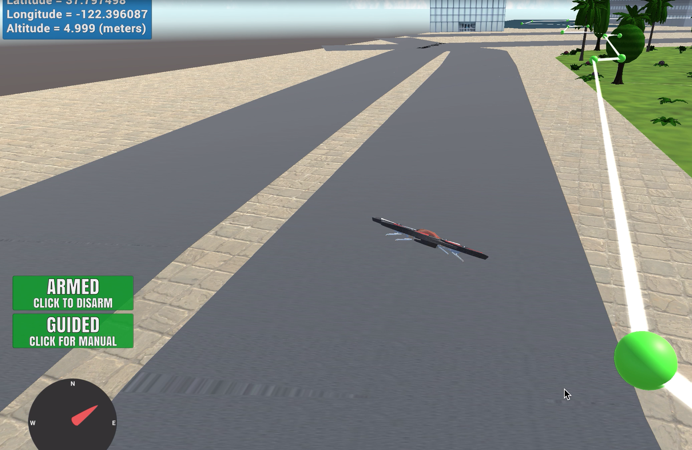

---
# Building on the the Udacity FCND planning project starter codes.

The planning project starter codes includes the motion_planning.py and planning_utils.py codes. 

The planning_utils code includes basic functions to generate a grid given obstacle points contained in the colliders.csv file, an implementation of the A* search algorithm, an implementation of the euclidean distance heuristic for estimating the cost from a current node to a goal during A start search, a definition of valid actions and criteria for selecting valid actions from any given node/state in the grid.

The motion_planning.py code includes a States class and a motion planning class which contains function definitions of the various quadcopter transitions and a template for the plan_path function.

Unlike the backyard_flyer_solution.py code which restricts the trajectory/ waypoints of the drone to a box defined in the calculate_box function.

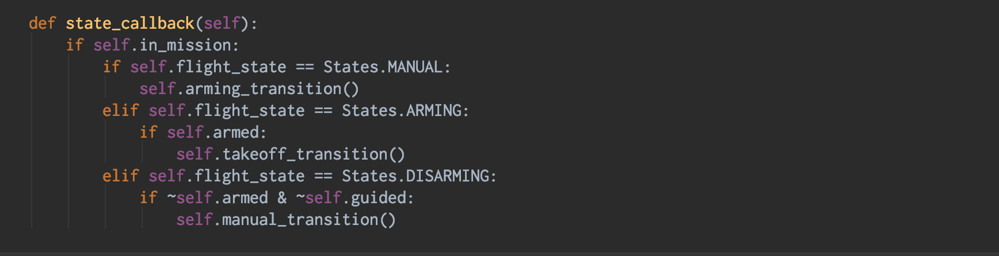

Also for the backyard_flyer_solution, the box trajectory is made after take_off transition while in the motion_planning.py the path is created immediately after the arming transition before take_off.

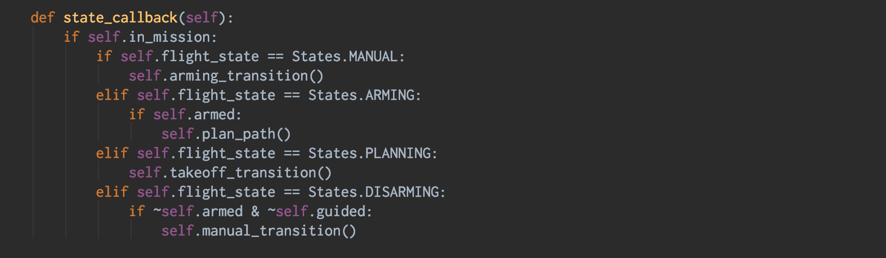

#### Set Home Position for Quadcopter

I wrote code to read the first line of the colliders.csv file to extract lat0 and lon0 as floating point values then I used the self.set_home_position() method to set our global home position to be the obtained lat0, lon0 and default alt = 0 values.
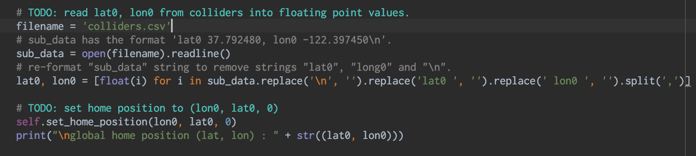Load obstacle data and set global home position.

#### Determined local position relative to global home position.

In the starter code, it is  assumed the drone takes off from map center in order to make the choice of where the drone takes off more flexible I had to retrieve the current position of the drone and compute the relative position of the drone to the defined global home position.

To obtain the current global position of the drone I used self._latitude, self._longitude and self._altitude and  global_to_local() to obtain the relative position of the drone  with the current global position and  self.global_home as parameters.

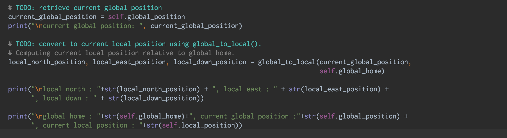

#### Added flexibility to the start location

I changed the start position of our path planner from the center of the grid to the current position of the drone in a generated grid.

To generate the grid,I considered the full extent of all obstacle points from the colliders.csv file and set the dimensions of the grid such that the grid encompasses all obstacles retaining their relative positions (from the global home).

To obtain the current position/ now start position of the drone on the grid, I applied the north_offset and east_offset values to translate the data points generated from the colliders.csv file to the newly defined grid and obtain their new co-ordinates.

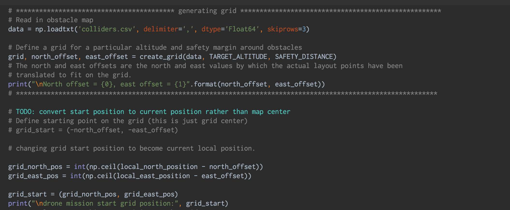

#### Added flexibility to goal location

I changed the start position of our path planner from the default point 10m north, 10m east of  center of the grid to a random un-occupied point on the grid.

To generate a random un-occupied point on the grid I wrote a function random_goal_search()
to choose a random un-occupied point on the grid and compute the equivalent global position of that point.

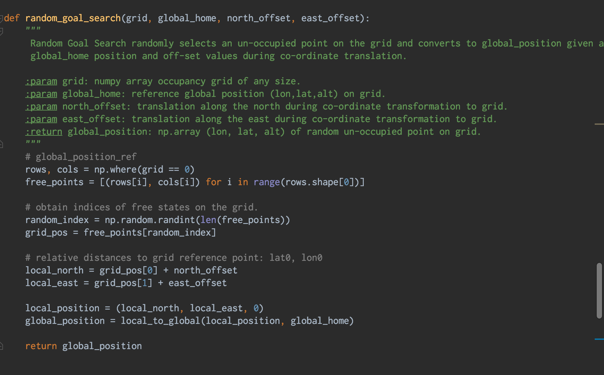

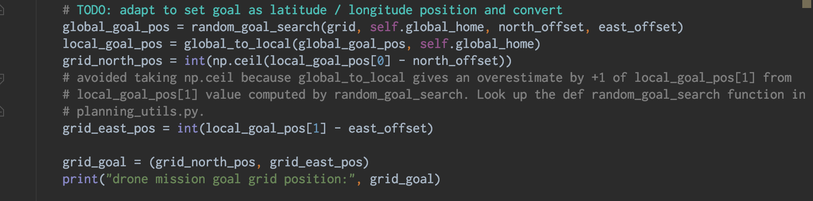

#### Added diagonal motions to  A* search algorithm

I edited the Actions class in the planning_utils.py. code to include diagonal motions in the NW, NE, SW & SE directions with an action cost of root 2 corresponding to the diagonal distance between vertices of a 1unit  x 1 unit block. To enable the A* search algorithm used to determine a path to the goal consider diagonal motions during planning.

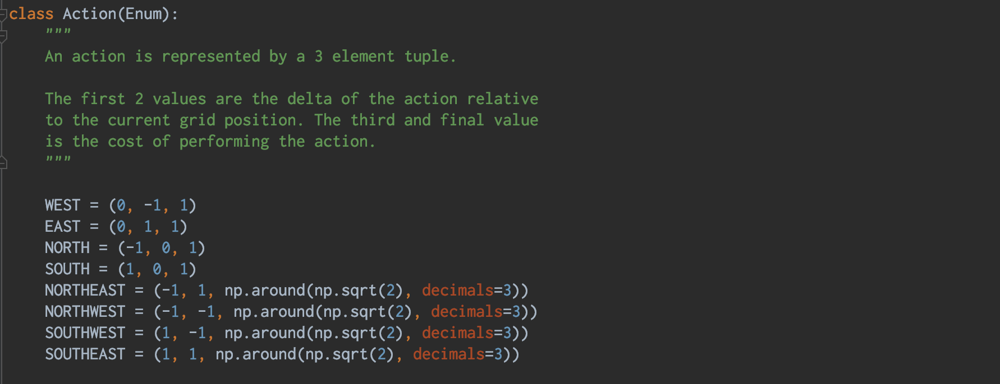

Also, I added conditions for which translations by diagonal motion is valid from a current node in the valid_actions() function definition.

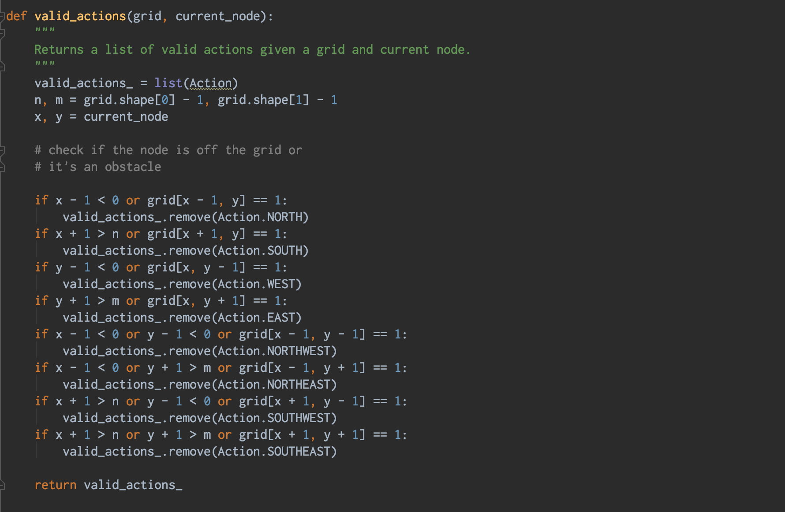

#### Pruned path of unnecessary waypoints using a Collinearity Test algorithm.

I implemented a collinearity check function to test if any three points are collinear (lie on the same line). If a point turns out to be collinear with two other points I eliminated the point. 

This significantly smoothened the trajectory of the drone and reduced the stops the drone had to proceed to the next waypoint. along a given straight line trajectory.

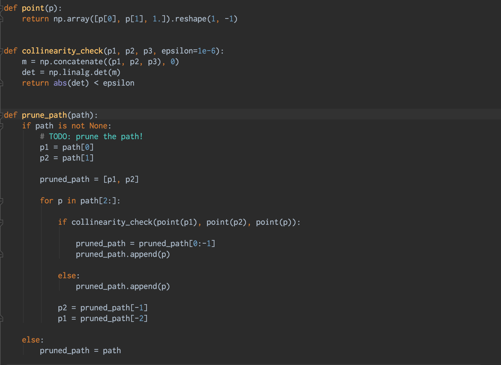

In addition, I implemented probabilistic roadmap planning. I experimented with various number of nodes and branching factors and observed experimentally that the greater the values for b and d, the more likely it is that there will be a sequence of edges that connects an arbitrary start node to another arbitrary goal node. I also included code to enable the drone align it’s heading with the next waypoint during flight.

#### In Summary: 

I really enjoyed this project because of the use of the Udacity FCND simulator to simulate the behaviour of the drone while implementing the path planning algorithm and the immediate applicability of the software on an actual drone.
